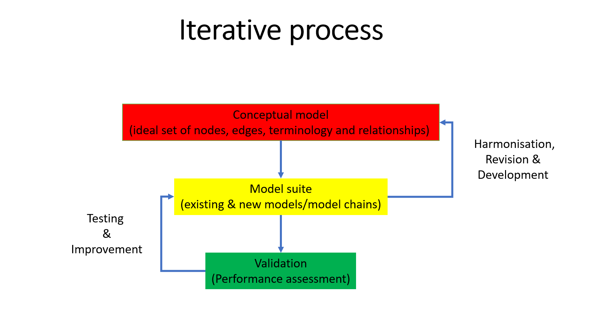

# PARC - Conceptual model for aggregate exposure modelling

This repository contains diagrams and specifications of the conceptual model for for aggregate exposure modelling developed in PARC project 6.2.1. The purpose of this conceptual model is to establish a formal consensus model for combining (human) exposure estimates to chemicals from (external) exposure models and deriving the corresponding internal exposures at some internal level. This model can be the basis for harmonization between different (external) exposure modelling tools and for establishing links between various tools. Later on, it may also serve as a basis for development of an ontology for aggregate exposure modelling.

At the present stage, this repository contains a main conceptual model diagram identifying the relevant entities and relationships, several sub-diagrams in which specific parts are worked out in more detail, and a [glossary](glossary.csv) of terms and definitions of the entities of the model. This model is constructed using the established glossary of PARC AD 6.3 as a basis and alignment between the diagram and this glossary should be maintained.

# Scope

Currently, the scope of the aggregate exposure conceptual model is restricted to human exposure. At a later stage, the scope could be broadened to also include environmental exposures. There is a known overlap with the following other related domains domains in PARC: human (bio)monitoring, toxicokinetic (TK) modelling (including PBK modelling), and source-to-dose modelling.

# Approach

An iterative approach is proposed to design the conceptual model to ensure that it is optimized for more pragmatic use. The process is depicted in the figure below.

- **Conceptual model:** ideal model - logical set of nodes, edges, terminology (glossary) and their relationships
- **Model suite (actual models available):** It represent the pragmatic interpretation available (not necessary perfect), in the context of PARC case studies.
- **Validation:** Parameters, equations and data available to test performance & evaluate accuracy & precision of the models and (propagated) predictions.

# Contributing

You can contribute in two ways:

1. Contribute in discussions by creating [issues](https://github.com/eu-parc/aggregate-exposure-modelling/issues) and participating in issue discussions suggesting improvements of terms/definitions and the relationships between the entities of the conceptual model.

2. By updating the diagrams and vocabularies. You can edit the diagram on your local machine by cloning the git repository and editting the diagram file using the standalone draw.io app. Alternatively you can use the online diagrams.net tool for this. For the latter, use the links below the diagrams. When you want to contribute to this repository, please request membership.

# Main diagram

[(edit online)](https://app.diagrams.net/#Heu-parc%2Faggregate-exposure-modelling%2Fdevelop%2Fdiagrams%2Faggregate-exposure-modelling.drawio.svg)

# Legend

[(edit online)](https://app.diagrams.net/#Heu-parc%2Faggregate-exposure-modelling%2Fdevelop%2Fdiagrams%2Flegend.drawio.svg)

# Sub-group: exposure event

**Exposure event:** A single event during which there is continuous contact between a substance and a target. The event is normally of a short duration (less than 24 hours). The attribute ""continuous contact"" in this context means that there is no interruption of the exposure.

**Exposure duration:** The length of time over which continuous or intermittent contacts occur between a substance and a target. For example, if an individual is in contact with an agent for 10 min, it is short term exposure. If the contact is every day for 300 days over a 1-year time period, the exposure duration is 1 year; it is long-term exposure.

**Exposure frequency:** The number of exposure events in an exposure duration.

[(edit online)](https://app.diagrams.net/#Heu-parc%2Faggregate-exposure-modelling%2Fdevelop%2Fdiagrams%2Fsub-group-exposure-event.drawio.svg)

# Sub-group: exposure pathway

**Exposure scenario:** A combination of facts, assumptions, and inferences that define a discrete situation where potential exposures may occur. These may include the exposure source, the exposed target population, and the time frame of exposure, microenvironment, and activities. Scenarios are often created to aid exposure assessors in estimating exposure (WHO/IPCS, 2004).

**Exposure pathway:** The course a substance takes from its source to the exposed individual or population, or a part of that course. An exposure pathway involves in general one or several transfer mechanisms from emission sources to exposure sources, and/or between several related exposure sources (e.g., from soil to food).

[(edit online)](https://app.diagrams.net/#Heu-parc%2Faggregate-exposure-modelling%2Fdevelop%2Fdiagrams%2Fsub-group-exposure-pathway.drawio.svg)

# Sub-group: exposure route

**Exposure route:** The way in which a substance reaches an external exposure surface, starting from the exposure source. These are oral ingestion, inhalation and dermal contact. Each exposure route is generally associated with a particular absorption behaviour through the absorption barriers surface that directly or indirectly separates the external exposure surfaces (outer or inner surfaces) from the internal exposure surfaces.

[(edit online)](https://app.diagrams.net/#Heu-parc%2Faggregate-exposure-modelling%2Fdevelop%2Fdiagrams%2Fsub-group-exposure-route.drawio.svg)

# Sub-group: exposure source

**Exposure source:** The origin of substance or a mixture for the purposes of an exposure assessment, in immediate contact with outer surfaces of exposure, to which individuals in the target population may be exposed. Examples are food, drinking water, consumer products, indoor air, outdoor air, dust and soil.

[(edit online)](https://app.diagrams.net/#Heu-parc%2Faggregate-exposure-modelling%2Fdevelop%2Fdiagrams%2Fsub-group-exposure-source.drawio.svg)

# Sub-group: exposure target

**Exposure (target):** Any biological entity that receives an exposure or a dose (e.g., a human, a human population, or a human organ).

[(edit online)](https://app.diagrams.net/#Heu-parc%2Faggregate-exposure-modelling%2Fdevelop%2Fdiagrams%2Fsub-group-exposure-target.drawio.svg)
